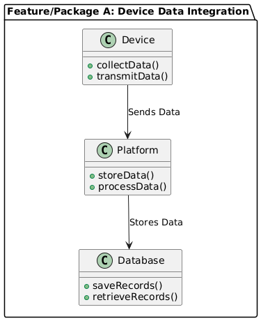
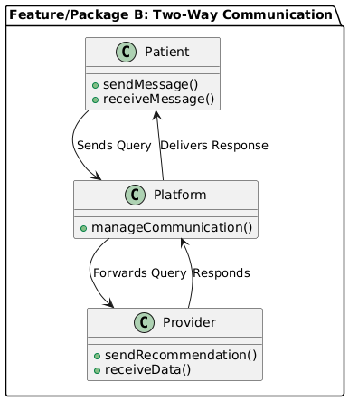
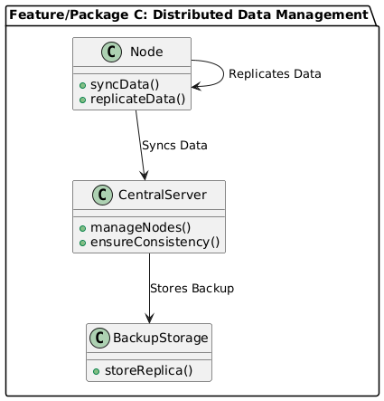
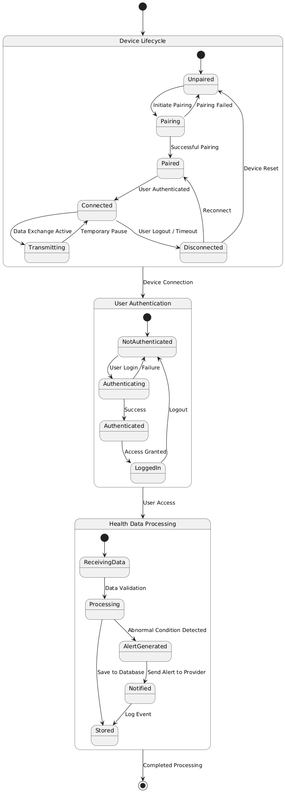

#### Assignment 1: Requirements Specification Document

### Title: Requirements Specification for a Distributed Healthcare Communication Platform

###### Student: Mafruha Chowdhury
##### Course: CIDM 6330  
##### Date: 02/09/2025 

## Introduction
Effective communication among patients, providers, and healthcare organizations is essential for quality care, particularly in managing chronic conditions. The **Distributed Healthcare Communication Platform** aims to bridge the gap in data interpretation and device interoperability by enabling **real-time insights, secure device communication, and enhanced patient-provider interactions**. This document outlines the **system's requirements, use cases, and architectural design**, aligning with the goals of improving healthcare communication and patient outcomes.

  
<strong>Table of Contents</strong>

1. [**Requirements Statements**](#1-requirements)
   - [User Stories](#11-user-stories)
   - [Use Cases](#12-use-cases)
   - [Features](#13-features)
   - [Gherkin Validation](#14-gherkin-validation)
2. [**Specifications**](#2-specifications)
   - [Concept](#21-concept)
   - [UX Notes](#22-ux-notes)
   - [Interfaces (Controls)](#23-interfaces-controls)
   - [Behaviors (Including UML Diagrams)](#24-behaviors)
3. [**UML Diagrams**](#3-uml-diagrams)
   - [Structural Diagrams](#31-structural-diagrams) | Containing the following diagrams
     - [Class Diagram](#class-diagram)
     - [Component Diagram](#component-diagram)
     - [Deployment Diagram](#deployment-diagram)
     - [Package Diagram](#package-diagram)
   - [Behavioral Diagrams](#32-behavioral-diagrams) |Containing the following diagrams
     - [Use Case Diagram](#use-case-diagram)
     - [Sequence Diagram](#sequence-diagram)
     - [State Diagram](#state-diagram)
     - [Activity Diagram](#activity-diagram)
     - [Interaction Overview Diagram](#interaction-overview-diagram)

## 1. Requirements
### 1.1 User Stories
1. *As a patient*, I want to securely connect my healthcare devices to the platform so that I can monitor my health data in real time.  
2. *As a healthcare provider*, I want to access patient data remotely so that I can provide timely recommendations and interventions.  
3. *As a healthcare organization*, I want a system that ensures interoperability between different devices so that patient data flows seamlessly.  
4. *As a device manufacturer*, I want the platform to support multiple data formats so that integration with existing devices is feasible.  

### 1.2 Use Cases
- **UC1**: A patient connects a glucose monitor to the platform.  
- **UC2**: A healthcare provider receives an alert for a patient's abnormal vital signs.  
- **UC3**: A device-to-device communication event synchronizes data across multiple devices.  
- **UC4**: A healthcare organization monitors system uptime and security compliance.  

### 1.3 Features
- **Device Data Integration**: Real-time data collection from healthcare devices.  
- **Distributed Data Management**: Ensuring real-time synchronization and fault tolerance.  
- **Device-to-Device Communication**: Secure interoperability across devices.  
- **Patient Dashboard**: Actionable insights, visualizations, and alerts.  
- **Provider Dashboard**: Real-time patient monitoring and trend analysis.  
- **Two-Way Communication**: Secure messaging and video consultations.  
- **Educational Resources**: Patient education on chronic condition management.  
- **Scalability and Security**: Compliance with healthcare data regulations.  

### 1.4 Gherkin Validation
- **Scenario: Patient connects a healthcare device**
  - **Given** a registered patient has a compatible healthcare device,
  - **When** they pair the device with the platform,
  - **Then** the system should securely store and display real-time data.

- **Scenario: Provider receives an alert**
  - **Given** a patient’s health metrics exceed a critical threshold,
  - **When** the system detects abnormal values,
  - **Then** an alert is sent to the assigned healthcare provider.

- **Scenario: Device-to-Device Communication**
  - **Given** multiple healthcare devices are connected to the platform,
  - **When** data synchronization is required,
  - **Then** the system ensures secure and real-time data exchange between devices.

- **Scenario: Secure Data Transmission**
  - **Given** a healthcare device is actively transmitting data,
  - **When** the platform processes incoming health metrics,
  - **Then** the data should be encrypted and securely stored in compliance with regulations.

- **Scenario: Authentication and Compliance**
  - **Given** a user attempts to access patient data,
  - **When** authentication is required,
  - **Then** the system should verify credentials and log the access attempt.
  
- **Scenario: Patient connects a healthcare device**
  - **Given**  a registered patient has a compatible healthcare device,
  - **When**  they pair the device with the platform, 
  - **Then** the system should securely store and display real-time data. 
  
- **Scenario: Scenario: Provider receives an alert**
  - **Given**  a patient’s health metrics exceed a critical threshold
  - **When**  the system detects abnormal values, 
  - **Then** an alert is sent to the assigned healthcare provider.

- **Scenario: Scenario: Device-to-Device Communication**
  - **Given** multiple healthcare devices are connected to the platform, 
  - **When**  data synchronization is required,  
  - **Then** the system ensures secure and real-time data exchange between devices. 
- **Scenario: Scenario: Secure Data Transmission**
  - **Given** a healthcare device is actively transmitting data,
  - **When**  the platform processes incoming health metrics,   
  - **Then** the data should be encrypted and securely stored in compliance with regulations.
- **Scenario: Scenario: Authentication and Compliance**
  - **Given** a user attempts to access patient data,
  - **When**  authentication is required,
  - **Then** the system should verify credentials and log the access attempt.  
 

## 2. Specifications
### 2.1 Concept
The **Distributed Healthcare Communication Platform** provides **seamless, secure data exchange** across patient devices, healthcare providers, and medical organizations. It leverages **distributed architecture** to ensure **high availability, data redundancy, and security**.  

### 2.2 UX Notes
- Intuitive dashboards for both patients and providers.  
- Customizable alert settings.  
- Accessible via web and mobile applications.  

### 2.3 Interfaces (Controls)
- **Patient Interface**: Secure login, device pairing, data visualization, communication.  
- **Provider Interface**: Patient monitoring, data trend analysis, communication tools.  
- **Admin Interface**: System management, compliance monitoring, user management.  

### 2.4 Behaviors
1. **Feature/Package A**: Device Data Integration 
2. **Feature/Package B**: Two-Way Communication 
3. **Feature/Package C**: Distributed Data Management 

## 3. UML Diagrams
### 3.1 Structural Diagrams
  - **Class Diagram**
    - 
  - **Component Diagram large**
    - 
  - **Component Diagram**
    - 
  - **Deployment Diagram**
    - 

  - **Package Diagram 1**
    - 

  - **Package Diagram 2**
     - 

   - **Package Diagram 3**
     - 

### 3.2 Behavioral Diagrams
  - **Use Case Diagram**
    - 
  - **Sequence Diagram**
    - 
  - **State Diagram**
    - 
  - **Activity Diagram**
    - 
  - **Interaction Overview Diagram**
    - 

## Conclusion
This **requirements specification document** outlines the key **functional and non-functional aspects** of the **Distributed Healthcare Communication Platform**. By addressing the challenges in **patient-provider communication and device interoperability**, this system aims to **enhance healthcare outcomes** and **streamline chronic disease management** through distributed architecture. 
