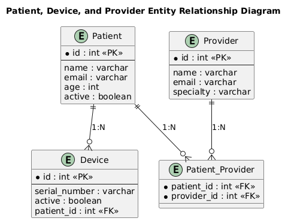

# CIDM6330 70

**West Texas A&M University**

    Semester: Spring 2025
    Course : CIDM6330/01/Software Engineering
    Student : Noblaira And Aiden

# Assignment 02: From Specification to API

This project provides a RESTful API using FastAPI to manage healthcare-related entities, including Patients, Devices, and Providers. It enables users to perform CRUD operations efficiently while ensuring data integrity through proper entity relationships and validation.

---

## Project Overview
This project is an API developed using FastAPI to demonstrate the implementation of an entity model and CRUD operations. The main objectives include:
- Developing an Applications Programming Interface (API) using FastAPI
- Creating an entity model to validate the API
- Preparing an Entity Relationship Diagram (ERD) for a persistence strategy using SQLite and SQLAlchemy

### Entity Selection
Based on the original ERD diagram, we selected the **Patient**, **Device**, and **Provider** entities to demonstrate the assignment requirements. These entities showcase the relationships and interactions between a patient, their associated medical devices, and healthcare providers.

---

## Entity Relationship Diagram (ERD)
The ERD defines the structure of our database, depicting the relationships between different entities. The selected entities for this project are:
- **Patient**: Represents individuals receiving healthcare services
- **Device**: Represents medical devices assigned to patients
- **Provider**: Represents healthcare providers managing patients

The ERD diagram has been saved as a **PDF** and included in the submission repository.

**[Patient | Device | Provider]**
- **Assignment-specific ERD Diagram**
  - 

- **Selected from Previous ERD/Class Diagram**
  - 

---

## Table of Contents

1. [Installation & Setup](#installation--setup)
   - [Clone the Repository](#1%EF%B8%8F%E2%83%A3-clone-the-repository)
   - [Create a Virtual Environment](#2%EF%B8%8F%E2%83%A3-create-a-virtual-environment)
   - [Activate Virtual Environment](#3%EF%B8%8F%E2%83%A3-activate-virtual-environment)
   - [Install Dependencies](#4%EF%B8%8F%E2%83%A3-install-dependencies)
   - [Setup Database](#5%EF%B8%8F%E2%83%A3-setup-database)
   - [Run the API Server](#6%EF%B8%8F%E2%83%A3-run-the-api-server)
2. [Project Folder Structure](#project-folder-structure)
3. [API Endpoints](#api-endpoints)
   - [Patient Routes](#patient-routes)
   - [Device Routes](#device-routes)
   - [Provider Routes](#provider-routes)
4. [Enhancing Database Relationships and Optimizing Queries for Efficiency](#enhancing-database-relationships-and-optimizing-queries-for-efficiency)
5. [Handling Validation Errors](#handling-validation-errors)
6. [CRUD Implementation](#crud-implementation)
7. [Notes](#notes)
8. [Future Implementations](#future-implementations-would-be-good-to-have)
9. [Conclusion](#conclusion)

---

## Installation & Setup

### 1️⃣ Clone the Repository
```sh
git clone <repository_url>
cd <repository_name>
```

### 2️⃣ Create a Virtual Environment
```sh
python -m venv venv
```

### 3️⃣ Activate Virtual Environment
#### Windows (PowerShell)
```sh
.\venv\Scripts\Activate
```
#### macOS/Linux
```sh
source venv/bin/activate
```

### 4️⃣ Install Dependencies
```sh
pip install -r requirements.txt
```

### 5️⃣ Setup Database
```sh
rm database/database.db  # Remove old DB (if exists)
python database/create_db.py  # Create new DB
```

### 6️⃣ Run the API Server
```sh
uvicorn main:app --reload
```

---

## Project Folder Structure
```
project-root/
│-- database/
│   ├-- create_db.py       # Script to initialize database
│   ├-- connection.py      # Database connection settings
│   ├-- models.py          # ORM models for tables
│   └-- database.db        # SQLite database file
│
│-- crud/
│   ├-- patient_crud.py    # CRUD functions for Patients
│   ├-- device_crud.py     # CRUD functions for Devices
│   └-- provider_crud.py   # CRUD functions for Providers
│
│-- routers/
│   ├-- patient_routes.py  # API routes for Patient CRUD
│   ├-- device_routes.py   # API routes for Device CRUD
│   └-- provider_routes.py # API routes for Provider CRUD
│
│-- cascade_relational_crud/
│   ├-- DELETE /patients/{patient_id}        # Delete a patient (cascade deletes devices & associations)
│   ├-- POST /patients/{patient_id}/providers/{provider_id}   # Assign a provider to a patient
│   ├-- DELETE /patients/{patient_id}/providers/{provider_id} # Remove provider from a patient
│   ├-- POST /patients/{patient_id}/devices/{device_id}       # Assign a device to a patient
│   └-- DELETE /patients/{patient_id}/devices/{device_id}     # Remove a device from a patient
│
│-- schemas/
│   ├-- patient_schema.py  # Pydantic schemas for Patients
│   ├-- device_schema.py   # Pydantic schemas for Devices
│   └-- provider_schema.py # Pydantic schemas for Provider
│
├-- main.py                # FastAPI main entry file
├-- requirements.txt       # Python dependencies
└-- README.md              # Project Documentation
```

---

## API Endpoints

### Patient Routes
- **POST** `/patients/` - Create a new patient
- **GET** `/patients/{patient_id}` - Retrieve patient details
- **PUT** `/patients/{patient_id}` - Update patient details
- **DELETE** `/patients/{patient_id}` - Delete a patient

### Device Routes
- **POST** `/devices/` - Create a new device
- **GET** `/devices/{device_id}` - Retrieve device details
- **PUT** `/devices/{device_id}` - Update device details
- **DELETE** `/devices/{device_id}` - Delete a device

### Provider Routes
- **POST** `/providers/` - Create a new provider
- **GET** `/providers/{provider_id}` - Retrieve provider details
- **PUT** `/providers/{provider_id}` - Update provider details
- **DELETE** `/providers/{provider_id}` - Delete a provider

---

## Enhancing Database Relationships and Optimizing Queries for Efficiency

### Current Implementation:
- **Entity Relationships:**
  - Many-to-Many between Patients and Providers
  - One-to-Many between Patients and Devices (cascade delete enabled)
- **ORM and Schema Management:**
  - SQLAlchemy ORM with declarative base models
- **Query Optimization:**
  - Queries fetch, update, and delete records efficiently but can be further optimized

### Enhancements and Optimizations:
- **Optimize Query Performance:**
  - Use `joinedload()` to fetch related entities in a single query
  - Implement indexing for frequently queried fields
- **Improve Relationship Handling:**
  - Fine-tune cascade behavior for controlled deletions
  - Explicit Foreign Key constraints for better integrity
- **Reduce Overhead with Asynchronous Queries:**
  - Utilize async SQLAlchemy for handling high request loads
- **Optimize Bulk Operations:**
  - Use batch inserts & updates instead of individual transactions

These enhancements will improve **scalability, efficiency, and maintainability** of our API. 🚀

---

## Handling Validation Errors
- If you encounter validation errors (e.g., `422 Unprocessable Entity`), ensure that request data matches the expected schema.
- Check that `patient_id`, `device_id`, and `provider_id` are integers in the request path.

---

## CRUD Implementation
The API implements CRUD operations using SQLAlchemy, enabling interaction with an SQLite database:
- **Create**: Adding new patient, device, and provider records.
- **Read**: Retrieving patient, device, and provider details.
- **Update**: Modifying existing records.
- **Delete**: Removing patient, device, and provider entries.

---

## Notes
- If encountering database errors, recreate it using:
```sh
rm database/database.db
python database/create_db.py
```
- Always activate the virtual environment before running any commands.

---

## Future Implementations Would Be Good to Have
- Authentication & Authorization (JWT, OAuth2, RBAC)
- Asynchronous Processing for high request loads
- Database Migrations & Performance Tuning
- Logging, Monitoring & API Testing
- FHIR & External API Integrations
- Frontend Dashboard (React/Vue.js)

---

## Conclusion
Through this exercise, I have significantly enhanced my understanding of Python, particularly in developing RESTful APIs using FastAPI. I gained hands-on experience in database management with SQLite, implementing CRUD operations, optimizing queries for efficiency, and ensuring data integrity through proper entity relationships. Additionally, working with SQLAlchemy, Pydantic models, and API validation improved my ability to design scalable and maintainable applications. Overall, this project has been a valuable learning experience, reinforcing best practices in backend development and API design.
```

