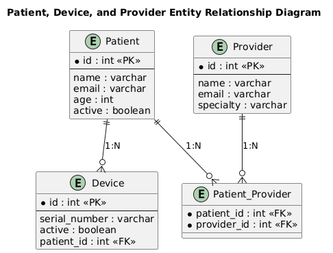

**West Texas A&M University**  
**Semester:** Spring 2025  
**Course:** CIDM6330/01/Software Engineering  
**Student:** Mafruha Chowdhury  

---

# Assignment 02: From Specification to API

This project provides a RESTful API using FastAPI to manage healthcare-related entities, including Patients, Devices, and Providers. It enables users to perform CRUD operations efficiently while ensuring data integrity through proper entity relationships and validation.

---

## Project Overview

This project is an API developed using FastAPI to demonstrate the implementation of an entity model and CRUD operations. The main objectives include:

- Developing an Applications Programming Interface (API) using FastAPI
- Creating an entity model to validate the API
- Preparing an Entity Relationship Diagram (ERD) for a persistence strategy using SQLite and SQLAlchemy

### Entity Selection

Based on the original ERD diagram, we selected the **Patient**, **Device**, and **Provider** entities to demonstrate the assignment requirements. These entities showcase the relationships and interactions between a patient, their associated medical devices, and healthcare providers.

---

## Entity Relationship Diagram (ERD)

### What is an ERD?

An **Entity Relationship Diagram (ERD)** visually represents how entities (tables) are related within your database. Each entity corresponds to a real-world concept or object, and relationships show how data in one entity can connect to data in another.

### Enhanced ERD

An **Enhanced ERD** extends the basic diagram to include more complex modeling features, such as:

- **Subtypes/Supertypes**: Inheritance-like structures.
- **Constraints**: Primary, foreign, and unique keys.
- **Cardinality & Optionality**: Indicates whether relationships are mandatory or optional.

### Our Project’s ERD

The ERD defines the structure of our database, depicting the relationships between different entities. The selected entities for this project are:

- **Patient**: Represents individuals receiving healthcare services
- **Device**: Represents medical devices assigned to patients
- **Provider**: Represents healthcare providers managing patients

The ERD diagram has been saved as a **PDF** and included in the submission repository.

**[Patient | Device | Provider]**

- **Assignment-specific ERD Diagram**  
  

- **Selected from Previous ERD/Class Diagram**  
  

---

## Table of Contents

1. [Installation & Setup](#installation--setup)  
2. [Project Folder Structure](#project-folder-structure)  
3. [API Endpoints](#api-endpoints)  
4. [Enhancing Database Relationships, Incorporating All Entities, and Optimizing Queries for Efficiency](#enhancing-database-relationships-incorporating-all-entities-and-optimizing-queries-for-efficiency)  
5. [Steps I Follow to Optimize | Minimize ERD](#steps-i-follow-to-optimize--minimize-erd)  
6. [Introducing Object-Oriented Concepts in ERD Design](#introducing-object-oriented-concepts-in-erd-design)  
7. [What If I Encounter a Recursive Relationship?](#what-if-i-encounter-a-recursive-relationship)  
8. [Handling Validation Errors](#handling-validation-errors)  
9. [CRUD Implementation](#crud-implementation)  
10. [Notes](#notes)  
11. [Future Implementations](#future-implementations-would-be-good-to-have)  
12. [Conclusion](#conclusion)

---

## Installation & Setup

### 1. Clone the Repository

```sh
git clone <repository_url>
cd <repository_name>
```

### 2. Create a Virtual Environment

```sh
python -m venv venv
```

### 3. Activate Virtual Environment

<details>
<summary>Windows (PowerShell)</summary>

```sh
.\venv\Scripts\Activate
```
</details>

<details>
<summary>macOS/Linux</summary>

```sh
source venv/bin/activate
```
</details>

### 4. Install Dependencies

```sh
pip install -r requirements.txt
```

### 5. Setup Database

```sh
rm database/database.db  # Remove old DB (if exists)
python database/create_db.py  # Create new DB
```

### 6. Run the API Server

```sh
uvicorn main:app --reload
```

---

## Project Folder Structure

```plaintext
project-root/
│-- database/
│   ├-- create_db.py       # Script to initialize database
│   ├-- connection.py      # Database connection settings
│   ├-- models.py          # ORM models for tables
│   └-- database.db        # SQLite database file
│
│-- crud/
│   ├-- patient_crud.py    # CRUD functions for Patients
│   ├-- device_crud.py     # CRUD functions for Devices
│   └-- provider_crud.py   # CRUD functions for Providers
│
│-- routers/
│   ├-- patient_routes.py  # API routes for Patient CRUD
│   ├-- device_routes.py   # API routes for Device CRUD
│   └-- provider_routes.py # API routes for Provider CRUD
│
│-- cascade_relational_crud/
│   ├-- DELETE /patients/{patient_id}               # Delete a patient (cascade deletes devices & associations)
│   ├-- POST /patients/{patient_id}/providers/{provider_id}   # Assign a provider to a patient
│   ├-- DELETE /patients/{patient_id}/providers/{provider_id} # Remove provider from a patient
│   ├-- POST /patients/{patient_id}/devices/{device_id}       # Assign a device to a patient
│   └-- DELETE /patients/{patient_id}/devices/{device_id}     # Remove a device from a patient
│
│-- schemas/
│   ├-- patient_schema.py  # Pydantic schemas for Patients
│   ├-- device_schema.py   # Pydantic schemas for Devices
│   └-- provider_schema.py # Pydantic schemas for Provider
│
├-- main.py                # FastAPI main entry file
├-- requirements.txt       # Python dependencies
└-- README.md              # Project Documentation
```

---

## API Endpoints

### Patient Routes

- **POST** `/patients/`  
  Create a new patient

- **GET** `/patients/{patient_id}`  
  Retrieve patient details

- **PUT** `/patients/{patient_id}`  
  Update patient details

- **DELETE** `/patients/{patient_id}`  
  Delete a patient

### Device Routes

- **POST** `/devices/`  
  Create a new device

- **GET** `/devices/{device_id}`  
  Retrieve device details

- **PUT** `/devices/{device_id}`  
  Update device details

- **DELETE** `/devices/{device_id}`  
  Delete a device

### Provider Routes

- **POST** `/providers/`  
  Create a new provider

- **GET** `/providers/{provider_id}`  
  Retrieve provider details

- **PUT** `/providers/{provider_id}`  
  Update provider details

- **DELETE** `/providers/{provider_id}`  
  Delete a provider

---

## Enhancing Database Relationships, Incorporating All Entities, and Optimizing Queries for Efficiency

### Incorporation of All Entities & Relationships

By carefully examining the specification and domain logic, we captured **all** relevant entities (both explicit and implicit) and their interconnections, ensuring our ERD and resulting database models cover every real-world scenario required by the application. This included:

- Identifying any **hidden** or implied entities from documentation and diagrams.
- Determining whether relationships should be **one-to-many**, **many-to-many**, or other, even if not immediately obvious.

### Current Implementation

- **Entity Relationships**:  
  - Many-to-Many between Patients and Providers  
  - One-to-Many between Patients and Devices (cascade delete enabled)

- **ORM and Schema Management**:  
  - SQLAlchemy ORM with declarative base models

- **Query Optimization**:  
  - Queries fetch, update, and delete records efficiently but can be further optimized

### Enhancements and Optimizations

- **Optimize Query Performance**:  
  - Use `joinedload()` to fetch related entities in a single query  
  - Implement indexing for frequently queried fields

- **Improve Relationship Handling**:  
  - Fine-tune cascade behavior for controlled deletions  
  - Explicit Foreign Key constraints for better integrity

- **Reduce Overhead with Asynchronous Queries**:  
  - Utilize async SQLAlchemy for handling high request loads

- **Optimize Bulk Operations**:  
  - Use batch inserts & updates instead of individual transactions

These enhancements will improve **scalability, efficiency, and maintainability** of our API. 🚀

---

## Steps I Follow to Optimize | Minimize ERD

1. **Normalization**  
   Look for duplicate fields or repeated data that could be separated out, ensuring each entity handles only its own unique attributes and associations.

2. **Refine Relationships**  
   Avoid a “crow’s nest” diagram by simplifying or merging closely related entities. Consider whether certain relationships might be more logically handled as sub-entities or joined tables.

3. **Clarify Attribute Types**  
   Each attribute should have a clear purpose, consistent data type, and proper constraints (e.g., `NOT NULL`, unique constraints) to avoid data redundancy or confusion.

---

## Introducing Object-Oriented Concepts in ERD Design

Depending on the domain and requirements, you could consider a **hybrid approach** that models **inheritance** or **composition** directly in the ERD. This can capture complex domain logic more accurately. For example, a “User” entity could be a parent, while “Patient” or “Provider” might be specialized sub-entities.

---

## What If I Encounter a Recursive Relationship?

- In some scenarios, an entity can relate to itself (e.g., an employee might supervise another employee).  
- Represent this carefully with a self-referencing foreign key, ensuring your diagram clearly illustrates the recursion.

---

## Handling Validation Errors

- If you encounter validation errors (e.g., `422 Unprocessable Entity`), ensure that request data matches the expected schema.  
- Check that `patient_id`, `device_id`, and `provider_id` are integers in the request path.

---

## CRUD Implementation

The API implements CRUD operations using SQLAlchemy, enabling interaction with an SQLite database:

- **Create**: Adding new patient, device, and provider records.  
- **Read**: Retrieving patient, device, and provider details.  
- **Update**: Modifying existing records.  
- **Delete**: Removing patient, device, and provider entries.

---

## Notes

- If encountering database errors, recreate it using:

  ```sh
  rm database/database.db
  python database/create_db.py
  ```

- Always activate the virtual environment before running any commands.

---

## Future Implementations Would Be Good to Have

- Authentication & Authorization (JWT, OAuth2, RBAC)
- Asynchronous Processing for high request loads
- Database Migrations & Performance Tuning
- Logging, Monitoring & API Testing
- FHIR & External API Integrations
- Frontend Dashboard (React/Vue.js)

---

## Conclusion

Through this exercise, I have significantly enhanced my understanding of Python, particularly in developing RESTful APIs using FastAPI. I gained hands-on experience in database management with SQLite, implementing CRUD operations, optimizing queries for efficiency, and ensuring data integrity through proper entity relationships. Additionally, working with SQLAlchemy, Pydantic models, and API validation improved my ability to design scalable and maintainable applications. Overall, this project has been a valuable learning experience, reinforcing best practices in backend development and API design.

---
