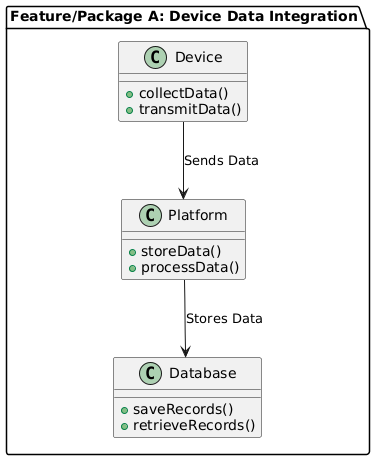
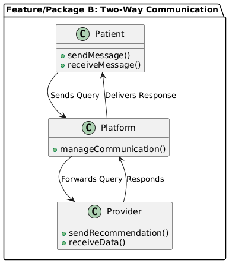
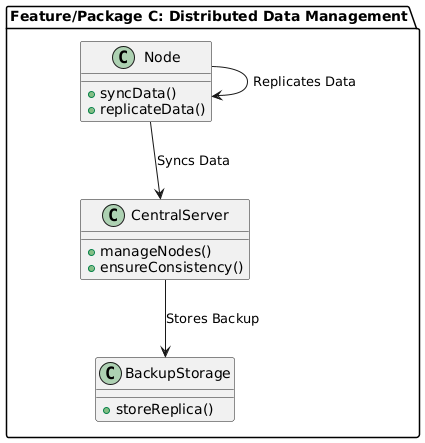
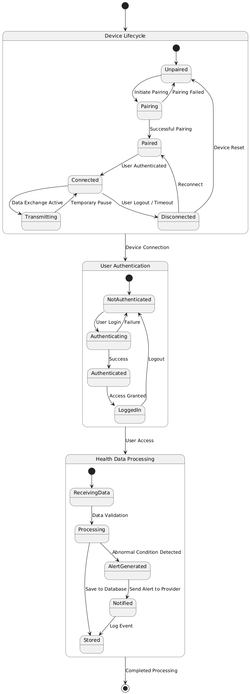

# CIDM6330 70 #

**West Texas A&amp;M University**

    Semester: Spring 2025 
    Course : CIDM6330/01/Software Engineering 
    Student : Mafruha Chowdhury
 
    Assignment 0: Domain Selection, the Unified Modeling Language, and an Introduction
  ---
 # Healthcare Device Communication #
 ## 📋 Table of Contents

- [Introduction](#introduction)
- [Problem and Domain](#problem-and-domain)
- [Personal| Professional Interest](#personalprofessional-interest)
- [Prototype System](#prototype-system)
- [Goals](#goals)
- [Stakeholders](#stakeholders)
- [📊 UML Diagrams](#-uml-diagrams)
  - [Structural Diagrams](#structural-diagrams)
  - [Behavioral Diagrams](#behavioral-diagrams)
- [Final Summary](#final-summary)
- [System Scalability and Resilience](#system-scalability-and-resilience)
- [Potential Future Technology Stack](#potential-future-technology-stack)
- [Compliance and Security Considerations](#compliance-and-security-considerations)

## Introduction ##

Effective communication among patients, providers, and healthcare organizations is essential for quality care, particularly for managing chronic conditions. Yet, interpreting data from devices like glucose meters, blood pressure monitors, pacemakers, and versatile communication tools such as mobile and remote devices remain challenging. This gap leads to poor treatment adherence and outcomes. A distributed software system can bridge this divide by enabling real-time insights, secure device communication, and better interactions between patients and providers.

## Problem and Domain ##

Problem: Patients often struggle to understand and integrate data from healthcare devices into their daily routines. Providers face difficulties in consistently monitoring this data and offering timely guidance. Devices frequently lack interoperability, creating silos that hinder seamless data sharing, while healthcare organizations encounter inefficiencies in process flow. Additionally, these challenges often disrupt care coordination and limit proactive intervention opportunities.

Domain: This problem lies within healthcare communication and chronic disease management, focusing on distributed architecture for efficient communication and data management among patients, providers, organizations, and devices. Distributed systems enable real-time, secure data exchange, ensuring efficient information flow and fostering device interoperability. For instance, a glucose monitor could automatically share data with a patient's healthcare team while syncing with other devices like fitness trackers, creating a comprehensive health profile. The domain spans patients using medical devices, providers managing their care, and the broader infrastructure supporting chronic disease management, fostering a secure and cohesive ecosystem for healthcare data.

## Personal/Professional Interest ##

I chose this domain due to my passion for leveraging distributed architecture to solve real-world healthcare problems. My interest lies in creating scalable, reliable, and secure systems that improve patient-provider communication and enable device interoperability. By addressing these challenges, I aim to enhance care delivery and optimize data flow, gaining expertise in both healthcare technology and distributed systems. This aligns with my aspirations to develop innovative and impactful solutions for the healthcare industry.

## Prototype System ##

The envisioned system is a Distributed Healthcare Communication Platform designed to improve understanding, monitoring, and communication for patients and providers, as well as enabling secure communication between healthcare devices. These features collectively address the needs of stakeholders and align with the system’s goals of improving healthcare communication and outcomes. Key features include:

1.	**Device Data Integration:** The platform collects real-time data from a variety of healthcare devices, such as blood pressure monitors, glucose meters, and wearables, consolidating it into a distributed system for reliable access.
2.	**Distributed Data Management:** Leveraging distributed architecture, the system ensures data is synchronized and accessible across multiple locations and devices in real-time, providing redundancy and fault tolerance.
3.	**Device-to-Device Communication:** Healthcare devices can securely communicate and exchange data directly through distributed networks, enabling interoperability and improving the quality of data insights.
4.	**Patient Dashboard:** A user-friendly interface translates complex data into actionable insights through visualizations, alerts, and personalized recommendations.
5.	**Provider Dashboard:** Healthcare providers can access a separate interface to monitor patient trends, receive alerts for out-of-range values, and provide tailored advice, all powered by distributed data communication.
6.	**Two-Way Communication:** The system enables secure messaging and video consultations, with communication routing through distributed servers for optimal performance and reliability.
7.	**Educational Resources:** The platform includes customized content to educate patients about managing their conditions effectively.
8.	**Scalability and Resilience:** The distributed architecture ensures the system can scale as more users and devices are added, maintaining high availability and performance.
9.	**Security:** Advanced encryption and access control mechanisms protect patient data and device communications, ensuring compliance with healthcare regulations.

By incorporating these features, the platform ensures adaptability to future challenges, fostering innovation and improving the overall healthcare experience.

### Goals: ###

* Empower organizations, patients, and providers with actionable health data to support informed decisions.

* Leverage advanced and adaptable technologies to prepare for future challenges.

* Enhance provider efficiency through automated data monitoring and trend analysis, allowing more focus on patient care.

* Improve health outcomes by supporting adherence to treatment plans and enabling proactive care interventions.

* Demonstrate the benefits of distributed systems in healthcare communication and data management, ensuring seamless and secure interoperability.

### Stakeholders: ###
*	Primary: Primary: Patients and healthcare providers, who benefit from improved data transparency and communication.
*	Secondary: Device manufacturers, healthcare organizations, and policymakers aiming to enhance chronic disease management and promote interoperability standards.

## UML Diagrams
### Structural Diagrams
  - **Class Diagram**
    - 
  - **Component Diagram large**
    - 
  - **Component Diagram**
    - 
  - **Deployment Diagram**
    - 

  - **Package Diagram 1**
    - 

  - **Package Diagram 2**
     - 

   - **Package Diagram 3**
     - 
 ---
### Behavioral Diagrams
  - **Use Case Diagram**
    - 
  - **Sequence Diagram**
    - 
  - **State Diagram**
    - 
  - **Activity Diagram**
    - 
  - **Interaction Overview Diagram**
    - 

---
## Final Summary

This system would act as a bridge between technology and healthcare, addressing critical gaps in communication, process flow, and data integration. By incorporating distributed architecture and secure device-to-device communication, the platform ensures robust, real-time data management and interaction. These features enhance resilience, scalability, and availability, ultimately leading to better chronic disease management outcomes while fostering innovation in healthcare technology.

Building upon the foundational system design outlined above, the following sections highlight key technical considerations, future technology stack projections, and compliance strategies essential for scaling and operationalizing the platform in a real-world healthcare environment.

## System Scalability and Resilience

The distributed architecture of the platform is designed to ensure horizontal scalability, allowing new devices, users, and services to be added without impacting system performance. Fault-tolerant data management strategies, real-time synchronization mechanisms, and distributed server communication further guarantee system availability and resilience. These capabilities are critical for healthcare communication systems where uptime and reliability directly affect patient outcomes.

---

## Potential Future Technology Stack

- **Backend Framework:** Django or FastAPI
- **Database:** PostgreSQL (primary storage), Redis (message brokering, caching)
- **Asynchronous Processing:** Celery with Redis or RabbitMQ
- **Deployment and Orchestration:** Docker, Kubernetes (for microservices scaling)
- **Security:** OAuth2 authentication, TLS encryption for data in transit, HIPAA compliance frameworks
- **Monitoring and Logging:** Prometheus, Grafana, and centralized logging services (e.g., ELK stack)

---

## Compliance and Security Considerations

Given the sensitive nature of healthcare data, the system design incorporates best practices for security and regulatory compliance. Future enhancements will include end-to-end encryption, role-based access control (RBAC) on user dashboards, secure authentication protocols, secure device-to-server communication, and adherence to HIPAA (Health Insurance Portability and Accountability Act) standards. Audit logging and anomaly detection mechanisms will be critical features in a production-grade version of the platform.

---
